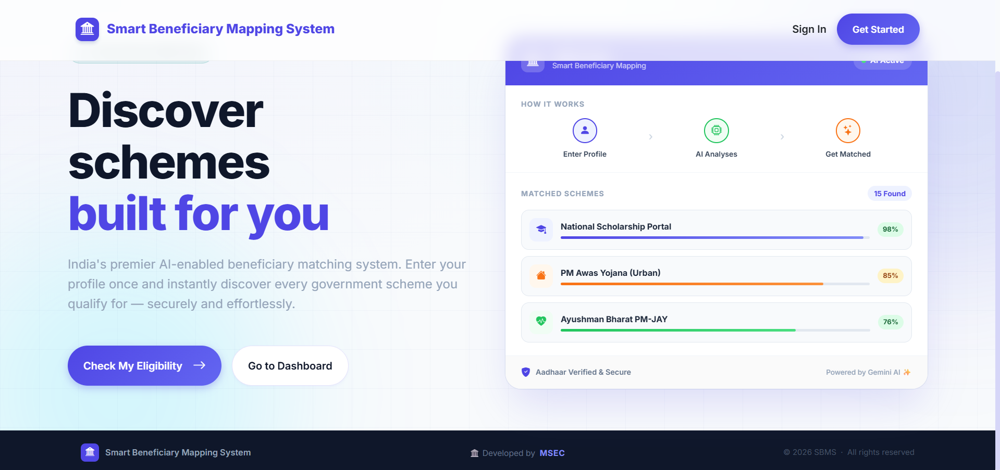
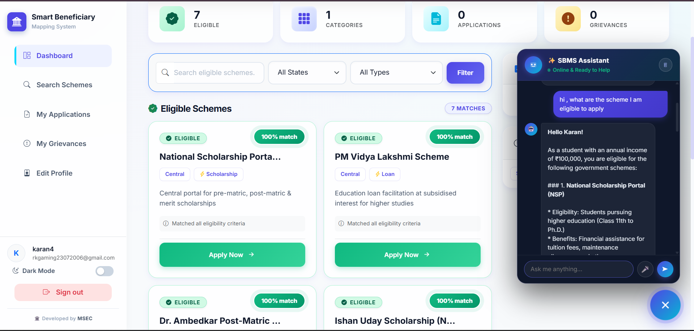
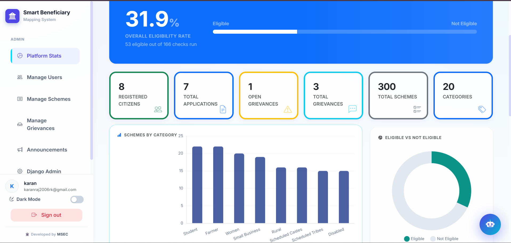

# 🏛️ Smart Beneficiary Mapping System (SBMS)

[](https://www.djangoproject.com/)
[](https://groq.com/)
[](https://www.mysql.com/)

**Smart Beneficiary Mapping System (SBMS)** is a state-of-the-art AI-driven discovery platform designed to simplify the complex landscape of Indian government schemes. By leveraging advanced NLP and machine learning, SBMS matches citizens with eligible welfare programs in seconds, ensuring that benefits reach the right people without the bureaucratic hurdles.

---

## 📸 Project Showcase

### 🚀 Landing Page

*Discover schemes built specifically for your profile with our intuitive AI-first landing page.*

### 📊 User Dashboard & AI Assistant

*Personalized recommendations, eligibility scores, and our signature **SBMS Assistant** powered by Llama 3.1.*

### 🛡️ Admin Intelligence Suite

*Comprehensive analytics for administrators to track platform engagement, eligibility rates, and grievance trends.*

---

## ✨ Key Features

- **🤖 AI-Powered Matching**: Uses Groq (Llama 3.1) and Gemini models to analyze user demographics and automatically calculate eligibility scores.
- **💬 SBMS Voice/Text Assistant**: A high-performance NLP chatbot that understands natural language queries about schemes and provides instant guidance.
- **📄 Personalized Document Checklist**: Generates a custom list of required documents for every scheme based on the user's specific profile.
- **📈 Real-time Analytics**: Native dashboard visualizations for both users (eligibility rates) and admins (platform stats).
- **⚖️ Integrated Grievance System**: A streamlined portal for users to raise complaints and track resolution status in real-time.
- **🌐 Secure & Scalable**: Production-ready architecture with Django, WhiteNoise for static assets, and cross-platform database support.

---

## 🛠️ Technology Stack

| Component | Technology |
| :--- | :--- |
| **Backend** | Django 5.2, Python 3.11+ |
| **Intelligence** | Groq API (Llama 3.1-8b), Gemini API |
| **Database** | MySQL (Railway), SQLite (Local) |
| **Frontend** | Vanilla CSS (Premium Glassmorphism), JavaScript (ES6+) |
| **Security** | Django-allauth (Google OAuth), Cryptography, PyJWT |
| **Deployment** | Gunicorn, WhiteNoise, Railway Cloud |

---

## ⚠️ Current Limitations & Roadmap

While SBMS provides a powerful matching engine, there are a few architectural limitations in the current version that we aim to address in future iterations:

### 🔻 Drawbacks
- **External Integration Gap**: Currently, the platform operates independently of official government scheme databases. As a result, we cannot "backtrack" or provide real-time status updates for applications once they move to external govt portals.
- **Static Document Evaluation**: The personalised document checklists are AI-generated based on provided profiles. However, since the system is not yet connected to official verification registries, real-time document validation is not available.

### ✅ Proposed Solutions (Roadmap)
- **DigiLocker API Integration**: For organizations deploying SBMS, we recommend integrating the **DigiLocker API**. This would allow for instant, tamper-proof verification of user documents like Aadhaar, Income Certificates, and Educational records directly through official channels.
- **Official Portal Connectivity**: We aim to establish API handshakes with centralized government hubs like **myScheme**. This would enable:
    1. **Live Application Tracking**: Users could monitor their progress across different departments directly from the SBMS dashboard.
    2. **Direct Submission**: Seamlessly push eligibility data and pre-filled forms from SBMS to official portals with a single click.

---

## 🚀 Getting Started

### 1. Prerequisites
- Python 3.11 or higher
- A Groq API Key (for the AI features)

### 2. Installation
```bash
# Clone the repository
git clone https://github.com/vip-sk07/Smart-Beneficiary-Mapping-System.git
cd Smart-Beneficiary-Mapping-System

# Install dependencies
pip install -r requirements.txt
```

### 3. Environment Setup
Create a `.env` file in the root directory and add your credentials:
```env
SECRET_KEY=your_django_secret_key
GROQ_API_KEY=your_groq_api_key
DATABASE_URL=your_mysql_url (Optional, defaults to SQLite)
```

### 4. Database Initialization
```bash
# Run the setup script to initialize the schema and data
python run_setup.py

# (Alternately) Run migrations
python manage.py migrate
```

### 5. Launch the Platform
```bash
python manage.py runserver
```
Visit `http://127.0.0.1:8000` to see SBMS in action!

---

## 🏗️ Project Architecture

```text
├── core/                # Core application logic, models, and AI services
├── templates/           # Premium HTML5 templates
├── staticfiles/         # Optimized CSS/JS/Assets
├── beneficiary_system/  # Project configuration
├── screenshots/         # Media for documentation (add your images here!)
├── run_setup.py         # Automated database setup utility
└── schema.py            # SQL Schema definitions
```

---

## 🤝 Contributing
Developed with ❤️ by **MSEC Team**. Contributions are welcome! Feel free to open a PR or report a bug.

---
© 2026 Smart Beneficiary Mapping System | Built for a better tomorrow.
